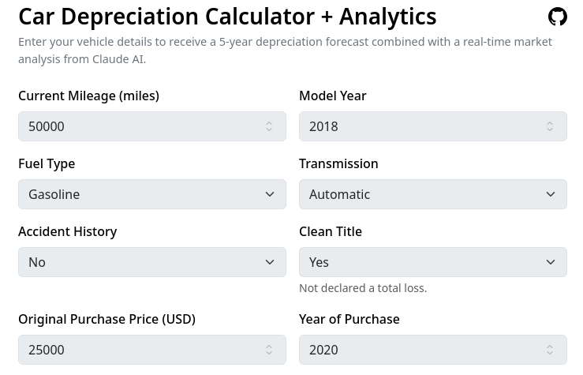

# Car Depreciation Calculator + Analytics

Want to sell your second-hand car in the U.S.? Get your insights with ML-powered price prediction and AI-powered market analysis!

### [Try it now!](https://car-depreciation-calculator-ui.vercel.app/)

If there is an error for AI requests, it is likely out of credits. Please deploy it locally with your own API key. Instructions at the bottom of README.

This is a continuation of [Car Depreciation Calculator](https://github.com/zeeliu7/car-depreciation-calculator).

## Features

* ✅ 5-year future value forecast based on a high-accuracy model (<0.04 MAE)
* ✅ Web searches on the latest government policies and customer demands in the U.S. that may affect your price
* ✅ Fully-automated insights based on comprehensive information for car sellers

## Example

From this:



To this:


## Local deployment instructions

Anthropic API key required.

```bash
cd car-depreciation-calculator-ui
cp .env.local.example .env.local
nano .env.local # and place your Anthropic API key in the file
npm run dev
```